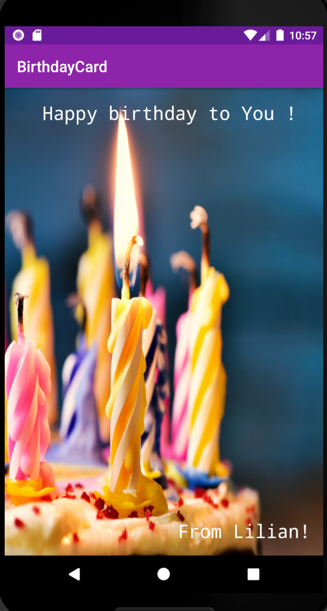

# Birthday Card
The purpose of this app is to show a birthday card.

## Getting Started 
These instructions will get you a copy of the project up and running on your local machine for
development and testing purposes. See deployment for notes on how to deploy the project on a live system.

### Screenshot

### Prerequisites
These are the things you need to install the software and how to install them
- Android studio
- JDK installed
- Fast Machine

### Installing
Follow these simple steps to get you started;
- Open Android studio
- `git clone git push --set-upstream origin develop`
- `git checkout develop`
- Run App

## Built With
- Android/Java